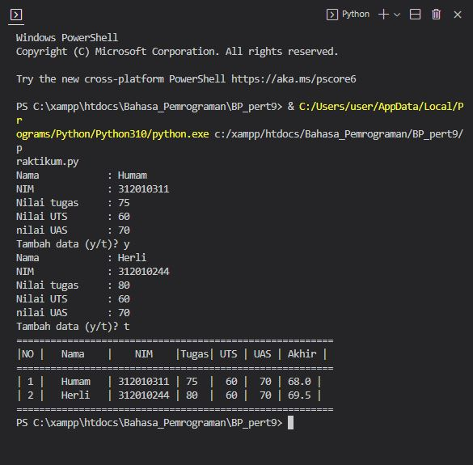

# **Program Menambahkan Data Pada Sebuah List**

- Memasukkan atau menambahkan data pada sebuah list, kita bisa menggunakan perintah 
    append(), extend() tapi untuk program kali ini kita menggunakan perintah append(), 
    karna kita akan menambahkan data satu persatu.
#
1. Pertama saya membuat sebuah variabel list kosong yang terdiri dari: nama=[], nim=[], tugas[], uts[], uas[], dan akhir[]. variabel list itu nanti yang akan kita isi dengan menggukan perintah append(), dan juga jangan lupa untuk membuat variabel lanjut = 'y' untuk perulangan while dan no = 0 untuk nomor pada output an nantinya

#
2. Cara untuk melakukan penambahan data pada variabel list yang sudah kita buat tadi adalah dengan menggunakan  perulangan while supaya kita bisa menambahkan lebih dari satu kali atau satu data dan perulangan tersebut akan berakhir ketika kita mengetikkan tidak sama dengan y atau !='y' dalam program (while lanjut == 'y'), tetapi sebelum itu kita harus membuat inputan sebuah variabel agar nanti proses perhtungan nilai akhir tidak eror, karena kita tidak bisa membuat operator aritmatika pada data list. kode programnya sebagai berikut:
    - na = str(input('Nama: '))
    - ni= int(input('NIM: '))
    - tug= int(input('Nilai tugas: '))
    - ut = int(input('Nilai UTS: '))
    - us= int(input('nilai uas: '))

Kode program untuk proses perhitungan pada nilai akhir yang di ambil dari tugas 30%, uts 35% dan uas 35%, jika ditulis dalam kode program menjadi :
    - akhir=(tugas*0.3)+(uts*0.35)+(uas*0.35)
lalu kita akan gunakan perintah append() agar nanti nilai yang di inputkan bisa masuk kedalam variabel list yang tadi sudah kita buat:
    - nama.append(na)
    - nim.append(ni)
    - tugas.append(tug)
    - uts.append(ut)
    - uas.append(us)
    - akhir.append(akh)

- 

kita juga menggunakan operator assigment pada variabel no, yang berfungsi agar nanti menjadi batas atau range pada perulangan for - no+=1

terakhir kita input 'lanjut (y/t)? tadi sudah kita bahas soal fungsi lanjut ini yakni untuk mengulangi perulangan while, jika 'y' maka akan melanjutkan perulangan nya tetapi, jika selain 'y' maka perulangan akan berhenti.

3. Menampilkan atau output dari program yang sudah kita buat disini kita menggunakan perulangan for 
    - for i in range(no)
    print(nama[i], nim[i], tugas[i], uts[i], uas[i], akhir[i])
di output an ini kalian bebas berkreasi agar tampilan lebih menarik.

# Contoh Program

# Hasil Program 
